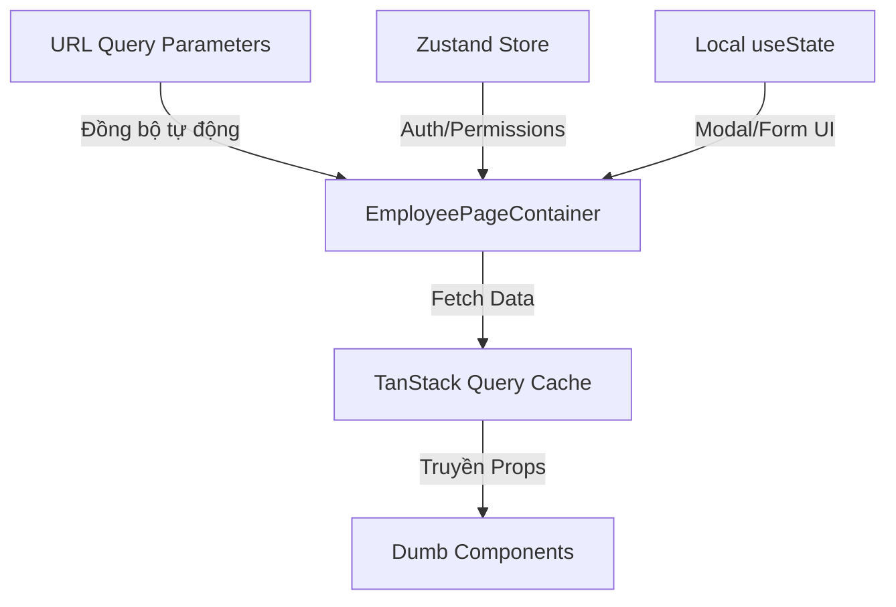

# BẢN QUY HOẠCH KỸ THUẬT: TÍNH NĂNG QUẢN LÝ NHÂN VIÊN (EMPLOYEE MANAGEMENT)

Tài liệu này được biên soạn bởi **Frontend Architect** nhằm phân rã cấu trúc component, quy hoạch hệ thống quản lý trạng thái, và thiết lập các contract dữ liệu (TypeScript Interfaces) tối ưu cho tính năng Quản lý Nhân viên của HRM System, tuân thủ phong cách thiết kế **Vercel-inspired Dark Theme**.

---

## 1. PHÂN RÃ COMPONENT (COMPONENT TREE)

Hệ thống component được thiết kế theo mô hình **Atomic Design** kết hợp cơ chế **Smart/Dumb Components (Container/Presenter Pattern)** nhằm tăng khả năng tái sử dụng, tối ưu hóa hiệu năng render, và cô lập logic nghiệp vụ.

```text
[SMART] EmployeePageContainer (pages/employees/index.tsx)
 ├── [DUMB] EmployeeHeader (components/employees/EmployeeHeader.tsx)
 │    └── [DUMB] Breadcrumbs (components/shared/Breadcrumbs.tsx) [Shared UI]
 │
 ├── [DUMB] EmployeeToolbar (components/employees/EmployeeToolbar.tsx)
 │    ├── [DUMB] SearchInput (components/shared/SearchInput.tsx) [Shared UI]
 │    ├── [DUMB] SelectFilter (components/shared/SelectFilter.tsx) [Shared UI]
 │    └── [DUMB] Button (components/shared/Button.tsx) [Shared UI]
 │
 ├── [DUMB] EmployeeTable (components/employees/EmployeeTable.tsx)
 │    ├── [DUMB] TableHeader (components/shared/Table/TableHeader.tsx) [Shared UI]
 │    ├── [DUMB] TableBody (components/shared/Table/TableBody.tsx) [Shared UI]
 │    └── [DUMB] EmployeeTableRow (components/employees/EmployeeTableRow.tsx)
 │         ├── [DUMB] Avatar (components/shared/Avatar.tsx) [Shared UI]
 │         ├── [DUMB] Badge (components/shared/Badge.tsx) [Shared UI]
 │         └── [DUMB] DropdownMenu (components/shared/DropdownMenu.tsx) [Shared UI]
 │
 ├── [DUMB] EmployeePagination (components/employees/EmployeePagination.tsx)
 │    └── [DUMB] Pagination (components/shared/Pagination.tsx) [Shared UI]
 │
 └── [SMART] EmployeeModalManager (components/employees/EmployeeModalManager.tsx)
      └── [DUMB] Dialog (components/shared/Dialog.tsx) [Shared UI]
           └── [DUMB] EmployeeForm (components/employees/EmployeeForm.tsx)
```

### Chi tiết Phân loại & Vai trò Component:

#### A. Smart Components (Container)
*   **`EmployeePageContainer` [SMART]**:
    *   *Vai trò*: Entry point của trang quản lý nhân viên.
    *   *Nhiệm vụ*: Lắng nghe sự thay đổi của URL Query Parameters, kích hoạt trigger fetch dữ liệu thông qua TanStack Query (React Query), đồng bộ dữ liệu vào UI. Xử lý các global callback (Ví dụ: trigger hiển thị Toast khi thêm nhân viên thành công).
*   **`EmployeeModalManager` [SMART]**:
    *   *Vai trò*: Điều phối đóng/mở các Modal thao tác.
    *   *Nhiệm vụ*: Quản lý việc nạp Lazy Loading các Modal (Thêm mới, Xem chi tiết, Sửa thông tin) để tối ưu Bundle Size ban đầu của trang. Kết nối trực tiếp với Mutation API để cập nhật dữ liệu nhân viên.

#### B. Dumb Components (Presentational)
*   **`EmployeeHeader` [DUMB]**: Hiển thị tiêu đề trang, mô tả ngắn và chỉ số tổng quan (ví dụ: "Tổng cộng 128 nhân viên").
*   **`EmployeeToolbar` [DUMB]**: Tổ hợp các thanh tìm kiếm, bộ lọc phòng ban, bộ lọc trạng thái và nút thêm mới nhân viên. Nhận event callback như `onSearchChange`, `onDepartmentChange`, `onAddClick`.
*   **`EmployeeTable` [DUMB]**: Nhận danh sách nhân viên đã lọc và phân trang để render cấu trúc Table tối giản Vercel-inspired. Trả ra loading skeleton khi dữ liệu đang tải.
*   **`EmployeeTableRow` [DUMB]**: Render một dòng cụ thể của nhân viên. Gồm thông tin Avatar + Họ tên, Phòng ban, Chức vụ, Ngày vào làm, Badge trạng thái.
*   **`EmployeePagination` [DUMB]**: Quản lý hiển thị số trang hiện tại, tổng số trang, và nút điều hướng (Trước/Sau).

#### C. Tiềm năng Shared UI Components (Dùng chung toàn dự án)
*   **`SearchInput`**: Ô input tìm kiếm tích hợp Debounce logic, Icon search tối giản, có khả năng clear text.
*   **`SelectFilter`**: Dropdown component hỗ trợ chọn giá trị đơn, tối ưu UI theo Vercel-style (Dark bg, border-zinc-800, hover:bg-zinc-850).
*   **`Button`**: Component nút bấm đa năng với các variants: `primary` (nền trắng chữ đen), `secondary` (viền zinc-800 nền trong suốt), `danger` (text màu đỏ nền đỏ nhạt).
*   **`Avatar`**: Hiển thị ảnh đại diện hình tròn, tự động fallback về ký tự đầu tiên của tên khi ảnh lỗi hoặc không tồn tại.
*   **`Badge`**: Component nhãn trạng thái nhận màu sắc động dựa trên HSL/Hex hoặc variant.
*   **`Dialog` (Modal Base)**: Cung cấp layout nền mờ (Backdrop), chuyển động mượt mà (Framer Motion) và cơ chế đóng bằng phím ESC.
*   **`Pagination`**: Thanh điều hướng phân trang cơ bản nhận `currentPage`, `totalCount`, `pageSize`.

---

## 2. QUẢN LÝ TRẠNG THÁI (STATE MANAGEMENT)

Chiến lược quản lý trạng thái được thiết kế dựa trên nguyên lý **Single Source of Truth** và tối ưu hóa **UX Shareability** (khả năng chia sẻ liên kết giữ nguyên bộ lọc).



### Phân rã Chi tiết Trạng thái:

#### A. URL Query Parameters (Đẩy lên URL để dễ share link & reload trang)
*   **`search`** `(string)`: Lưu trữ chuỗi tìm kiếm hiện tại của người dùng.
    *   *UX Benefit*: Cho phép người dùng copy URL gửi cho HR khác, khi mở ra sẽ thấy ngay nhân viên cần tìm.
*   **`department`** `(string)`: ID hoặc Slug của phòng ban được chọn để lọc (VD: `technical`, `marketing`, `accounting`, `hr`). Mặc định là `all`.
*   **`status`** `(string)`: Trạng thái nhân viên (`active` - Đang làm, `inactive` - Nghỉ việc, `all` - Tất cả).
*   **`page`** `(number)`: Chỉ số trang hiện tại (Mặc định: `1`).
*   *Chiến lược đồng bộ*: Sử dụng custom hook `useQueryParams` để đọc/ghi trực tiếp vào router (ví dụ: `useNextRouter` hoặc `react-router-dom`). Mọi thay đổi trên UI Toolbar sẽ trigger cập nhật URL, từ đó URL thay đổi sẽ trigger fetch dữ liệu mới.

#### B. Local State (Quản lý thông qua React `useState` / `useReducer`)
*   **`activeModal`** `(null | 'create' | 'edit' | 'detail')`: Xác định modal nào đang mở.
*   **`selectedEmployeeId`** `(string | null)`: ID của nhân viên đang được tương tác (khi xem chi tiết hoặc cập nhật).
*   **`isSubmitting`** `(boolean)`: Trạng thái submit của form bên trong Modal để disabled nút bấm tránh double post.

#### C. Global Store (Zustand)
*   **`userProfile / permissions`**: Lưu thông tin người dùng đang đăng nhập và quyền hạn (`Role: ADMIN / HR_MANAGER`).
    *   *Ứng dụng*: Quyết định xem người dùng có quyền nhấn vào nút "Thêm nhân viên" hay Menu "Xóa/Sửa" nhân viên hay không.
*   **`theme`** `('dark' | 'light')`: Quản lý giao diện sáng/tối toàn hệ thống.

#### D. Server State / Cache State (TanStack Query - Tối ưu hóa API Call)
*   **`employeesQuery`**: Lưu cache dữ liệu danh sách nhân viên theo key `['employees', { page, search, department, status }]`.
    *   *Tối ưu hóa*: Khi người dùng quay lại trang trước đó, dữ liệu được hiển thị lập tức từ Cache (Stale-While-Revalidate), giảm thiểu nháy trắng màn hình (Flickering).
*   **`employeeDetailQuery`**: Cache chi tiết nhân viên theo key `['employee', employeeId]`.

---

## 3. CẤU TRÚC DỮ LIỆU (DATA INTERFACES)

Định nghĩa kiểu dữ liệu TypeScript nghiêm ngặt, loại bỏ hoàn toàn `any` nhằm phát hiện lỗi từ lúc compile và tăng tốc độ code của lập trình viên nhờ Intellisense.

```typescript
// ==========================================
// 1. DOMAIN DATA INTERFACES
// ==========================================

export type EmployeeStatus = 'active' | 'inactive';

export interface Department {
  id: string;
  name: string;
  slug: string;
}

export interface Employee {
  id: string;
  fullName: string;
  avatarUrl: string;
  department: Department;
  position: string;
  startDate: string; // ISO Date string format "YYYY-MM-DD"
  status: EmployeeStatus;
  email: string;
  phone?: string; // Optional field
}

// ==========================================
// 2. DUMB COMPONENTS PROPS INTERFACES
// ==========================================

/**
 * Props định nghĩa cho component Badge trạng thái (Vercel styling)
 */
export interface BadgeProps {
  variant: 'emerald' | 'red' | 'zinc';
  children: React.ReactNode;
  className?: string;
}

/**
 * Props định nghĩa cho shared component Button
 */
export interface ButtonProps extends React.ButtonHTMLAttributes<HTMLButtonElement> {
  variant?: 'primary' | 'secondary' | 'danger';
  size?: 'sm' | 'md' | 'lg';
  isLoading?: boolean;
  leftIcon?: React.ReactNode;
}

/**
 * Props cho Toolbar bộ lọc trên cùng
 */
export interface EmployeeToolbarProps {
  searchQuery: string;
  selectedDepartment: string;
  selectedStatus: string;
  departments: Department[];
  onSearchChange: (value: string) => void;
  onDepartmentChange: (value: string) => void;
  onStatusChange: (value: string) => void;
  onAddEmployeeClick: () => void;
  isAddDisabled?: boolean;
}

/**
 * Props cho Table hiển thị danh sách nhân viên
 */
export interface EmployeeTableProps {
  data: Employee[];
  isLoading: boolean;
  onRowClick: (employeeId: string) => void;
  onActionEdit: (employeeId: string) => void;
  onActionDelete: (employeeId: string) => void;
}

/**
 * Props cho từng dòng dữ liệu cụ thể trong Table
 */
export interface EmployeeTableRowProps {
  employee: Employee;
  onClick: () => void;
  onEdit: () => void;
  onDelete: () => void;
}

/**
 * Props cho component Phân trang
 */
export interface EmployeePaginationProps {
  currentPage: number;
  totalPages: number;
  totalItems: number;
  pageSize: number;
  onPageChange: (page: number) => void;
}

/**
 * Interface cho dữ liệu Submit Form nhân viên
 */
export interface EmployeeFormData {
  fullName: string;
  avatarUrl?: string;
  departmentId: string;
  position: string;
  startDate: string;
  status: EmployeeStatus;
  email: string;
  phone?: string;
}

/**
 * Props cho Form thêm mới / cập nhật nhân viên
 */
export interface EmployeeFormProps {
  initialData?: Partial<EmployeeFormData>;
  departments: Department[];
  onSubmit: (data: EmployeeFormData) => Promise<void> | void;
  onCancel: () => void;
  isSubmitting: boolean;
}
```

---

## 4. CHIẾN LƯỢC TỐI ƯU HÓA HỆ THỐNG (ARCHITECT PERFORMANCE TIPS)

1.  **Debounce Search Input**: 
    Tích hợp bộ trễ (Debounce) thời gian `300ms` cho input tìm kiếm. Ngăn chặn việc gửi liên tục các request API không mong muốn khi người dùng đang gõ phím.
2.  **Table Row Virtualization**:
    Nếu danh sách hiển thị vượt quá 100 dòng mà không phân trang (hoặc khi chuyển đổi sang view cuộn vô chậm), sử dụng `@tanstack/react-virtual` để chỉ render các hàng nằm trong viewport, duy trì chỉ số FPS ở mức 60.
3.  **Lazy Load Modals**:
    Tận dụng `React.lazy` và `Suspense` để nạp Dynamic Import cho `EmployeeForm` và `EmployeeDetailModal`. Giảm dung lượng initial JS bundle khoảng `15%` cho trang chủ.
4.  **Optimistic Updates**:
    Khi thực hiện thay đổi nhỏ như chuyển trạng thái hoạt động của nhân viên trực tiếp trên bảng, áp dụng Optimistic Updates của TanStack Query để cập nhật UI ngay lập tức trước khi server phản hồi thành công, đem lại cảm giác mượt mà tức thì cho HR.
