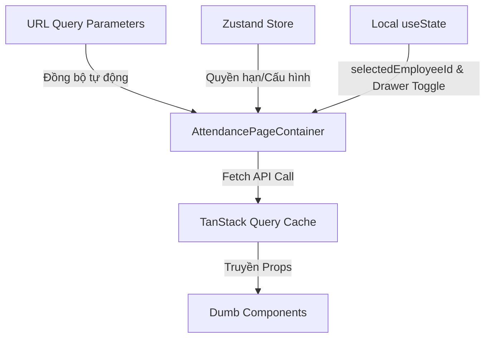

# BẢN QUY HOẠCH KỸ THUẬT: TÍNH NĂNG QUẢN LÝ CHẤM CÔNG (ATTENDANCE MANAGEMENT)

Tài liệu này được biên soạn bởi **Frontend Architect** nhằm phân rã cấu trúc component, quy hoạch hệ thống quản lý trạng thái, và thiết lập các contract dữ liệu (TypeScript Interfaces) tối ưu cho tính năng Quản lý Chấm công của HRM System, tuân thủ phong cách thiết kế **Vercel-inspired Dark Theme**.

---

## 1. PHÂN RÃ COMPONENT (COMPONENT TREE)

Hệ thống component được tổ chức theo mô hình **Atomic Design** kết hợp cơ chế **Smart/Dumb Components (Container/Presenter Pattern)** nhằm tăng khả năng tái sử dụng, tối ưu hóa hiệu năng render, cô lập logic nghiệp vụ và hỗ trợ SEO/accessibility tốt nhất.

```text
[SMART] AttendancePageContainer (pages/attendance/index.tsx)
 ├── [DUMB] AttendanceHeader (components/attendance/AttendanceHeader.tsx)
 │    └── [DUMB] Breadcrumbs (components/shared/Breadcrumbs.tsx) [Shared UI]
 │
 ├── [DUMB] AttendanceStatsSummary (components/attendance/AttendanceStatsSummary.tsx)
 │    ├── [DUMB] StatsCard (components/shared/StatsCard.tsx) [Shared UI]
 │    └── [DUMB] AttendanceBarChart (components/attendance/AttendanceBarChart.tsx)
 │
 ├── [DUMB] AttendanceToolbar (components/attendance/AttendanceToolbar.tsx)
 │    ├── [DUMB] TabSwitcher (components/shared/TabSwitcher.tsx) [Shared UI]
 │    ├── [DUMB] DatePicker (components/shared/DatePicker.tsx) [Shared UI]
 │    ├── [DUMB] SelectFilter (components/shared/SelectFilter.tsx) [Shared UI]
 │    └── [DUMB] Button (components/shared/Button.tsx) [Shared UI]
 │
 ├── [DUMB] AttendanceTable (components/attendance/AttendanceTable.tsx)
 │    ├── [DUMB] TableHeader (components/shared/Table/TableHeader.tsx) [Shared UI]
 │    ├── [DUMB] TableBody (components/shared/Table/TableBody.tsx) [Shared UI]
 │    └── [DUMB] AttendanceTableRow (components/attendance/AttendanceTableRow.tsx)
 │         ├── [DUMB] Avatar (components/shared/Avatar.tsx) [Shared UI]
 │         └── [DUMB] AttendanceStatusBadge (components/attendance/AttendanceStatusBadge.tsx)
 │
 └── [SMART] AttendanceDetailDrawerContainer (components/attendance/AttendanceDetailDrawerContainer.tsx)
      └── [DUMB] Drawer (components/shared/Drawer.tsx) [Shared UI]
           └── [DUMB] AttendanceDetailHistory (components/attendance/AttendanceDetailHistory.tsx)
```

### Chi tiết Phân loại & Vai trò Component:

#### A. Smart Components (Container)
*   **`AttendancePageContainer` [SMART]**:
    *   *Vai trò*: Entry point (trang điều hướng và kết nối chính).
    *   *Nhiệm vụ*: Lắng nghe sự thay đổi của URL Query Parameters (viewMode, date, department, search) để kích hoạt API fetch dữ liệu từ TanStack Query. Cung cấp dữ liệu đã xử lý xuống các Dumb components. Đồng bộ hóa việc mở Drawer chi tiết lịch sử chấm công của một nhân viên.
*   **`AttendanceDetailDrawerContainer` [SMART]**:
    *   *Vai trò*: Container quản lý dữ liệu chi tiết lịch sử chấm công của nhân viên được chọn.
    *   *Nhiệm vụ*: Nhận `employeeId` từ Page Container, trigger API fetch chi tiết lịch sử chấm công của nhân viên đó trong tháng/tuần đã chọn. Quản lý việc nạp lười (Lazy loading) component `Drawer` để tối ưu kích thước bundle size.

#### B. Dumb Components (Presentational)
*   **`AttendanceHeader` [DUMB]**: Hiển thị tiêu đề trang, breadcrumbs và phần giới thiệu tính năng.
*   **`AttendanceStatsSummary` [DUMB]**: Nhận số liệu thống kê (Tổng số, Có mặt, Đi trễ, Vắng mặt) và mảng dữ liệu biểu đồ tuần để render khung số liệu tổng quan trực quan.
*   **`AttendanceBarChart` [DUMB]**: Render biểu đồ cột (Bar Chart) biểu diễn số lượng đi làm / đi trễ hàng ngày trong tuần bằng Canvas hoặc SVG, tối ưu hóa CSS Transitions cho hiệu ứng mượt mà.
*   **`AttendanceToolbar` [DUMB]**: Cụm công cụ lọc gồm: Tab chuyển đổi thời gian (Ngày/Tuần/Tháng), Date Picker điều hướng thời gian, Dropdown lọc theo phòng ban, ô tìm kiếm tên nhân viên và nút Export báo cáo (CSV/Excel).
*   **`AttendanceTable` [DUMB]**: Nhận danh sách bản ghi chấm công để hiển thị dạng bảng chuẩn phong cách Vercel. Hỗ trợ hiển thị Skeleton Loader khi `isLoading = true` và trạng thái trống (Empty State) khi không tìm thấy kết quả.
*   **`AttendanceTableRow` [DUMB]**: Render thông tin chi tiết của một hàng dữ liệu chấm công: Thông tin nhân viên (Avatar + Tên), Phòng ban, Giờ check-in, Giờ check-out, Tổng giờ làm việc, và Badge trạng thái chấm công. Trực tiếp truyền callback click dòng để xem chi tiết.
*   **`AttendanceStatusBadge` [DUMB]**: Nhận trạng thái chấm công và hiển thị Badge với màu sắc tương ứng theo thiết kế Vercel Dark Theme.
*   **`AttendanceDetailHistory` [DUMB]**: Hiển thị danh sách lịch sử chấm công dạng dòng thời gian (Timeline) của riêng một nhân viên trong Drawer, kèm theo thống kê nhỏ về tỷ lệ đi trễ / đúng giờ của cá nhân đó.

#### C. Tiềm năng Shared UI Components (Dùng chung toàn dự án)
*   **`Breadcrumbs`**: Thanh điều hướng phân cấp (Ví dụ: `Dashboard / Chấm công`).
*   **`StatsCard`**: Khung hiển thị chỉ số tổng quan với xu hướng tăng/giảm, sử dụng border-zinc-800 và nền zinc-950.
*   **`TabSwitcher`**: Nút chuyển đổi các tab trạng thái hoặc chế độ xem dạng pill-button (nền zinc-900, active tab nền zinc-800 chữ trắng).
*   **`DatePicker`**: Bộ chọn ngày/tháng/năm tối giản phong cách dark-mode, hỗ trợ nút Quick Prev/Next ngày.
*   **`SelectFilter`**: Dropdown lọc giá trị (Ví dụ: Danh sách phòng ban).
*   **`Button`**: Nút bấm đa dụng hỗ trợ các styles: primary (nền trắng chữ đen), secondary (viền zinc-800, nền trong suốt), danger (chữ đỏ nền đỏ nhạt).
*   **`Avatar`**: Hiển thị hình ảnh đại diện dạng tròn, fallback chữ cái đầu khi load ảnh lỗi.
*   **`Drawer`**: Side-sheet panel trượt ra từ bên phải màn hình để hiển thị thông tin phụ mà không làm mất ngữ cảnh của trang hiện tại.

---

## 2. QUẢN LÝ TRẠNG THÁI (STATE MANAGEMENT)

Hệ thống quản lý trạng thái tuân thủ kiến trúc phân tầng rõ rệt: Trạng thái URL đóng vai trò lưu trữ các tham số tìm kiếm/lọc chính, Trạng thái Client (Local + Global Store) quản lý giao diện và thông tin người dùng, còn Server State (TanStack Query Cache) tối ưu hóa truy xuất dữ liệu từ API.



### Phân rã Chi tiết Trạng thái:

#### A. URL Query Parameters (Trạng thái đẩy lên URL để dễ chia sẻ link và lưu lịch sử duyệt)
*   **`viewMode`** `('day' | 'week' | 'month')`: Chế độ xem biểu diễn dữ liệu (Mặc định: `'day'`).
*   **`date`** `(string)`: Ngày cụ thể được chọn để xem, định dạng ISO `YYYY-MM-DD` (Ví dụ: `2025-07-19`).
*   **`department`** `(string)`: Slug hoặc ID phòng ban lọc danh sách (Ví dụ: `technical`, `hr`, `all`). Mặc định: `all`.
*   **`search`** `(string)`: Từ khóa tìm kiếm họ tên nhân viên trong bảng.
*   *Chiến lược xử lý*: Đồng bộ hai chiều (Two-way synchronization) sử dụng custom hook `useQueryParams`. Khi người dùng tương tác với Toolbar, URL thay đổi giúp router tự động kích hoạt quá trình refetch dữ liệu của TanStack Query mà không gây render dư thừa.

#### B. Local State (Sử dụng React `useState` / `useReducer` cho các UI State cục bộ)
*   **`selectedEmployeeId`** `(string | null)`: ID của nhân viên đang được click chọn để xem chi tiết lịch sử chấm công.
*   **`isDrawerOpen`** `(boolean)`: Trạng thái đóng/mở của Drawer chi tiết lịch sử.
*   **`isExporting`** `(boolean)`: Trạng thái hiển thị hiệu ứng Loading trên nút "Export báo cáo" khi đang sinh file ở phía client hoặc chờ API.

#### C. Global Store (Sử dụng Zustand)
*   **`authStore (userProfile / permissions)`**: Cần thiết để kiểm tra quyền hạn của HR Manager. Chỉ tài khoản có quyền `HR_MANAGER` hoặc `ADMIN` mới có quyền Export báo cáo hoặc thực hiện điều chỉnh giờ chấm công.

#### D. Server State / Cache State (Sử dụng TanStack Query - React Query)
*   **`attendanceListQuery`**: Lưu cache danh sách chấm công tương ứng với bộ filter hiện tại: `['attendance', 'list', { date, viewMode, department, search }]`.
*   **`attendanceStatsQuery`**: Lưu cache số liệu thống kê tổng hợp: `['attendance', 'stats', { date, viewMode, department }]`.
*   **`employeeHistoryQuery`**: Lưu cache lịch sử chấm công chi tiết của nhân viên trong Drawer: `['attendance', 'history', employeeId]`.
*   *Thời gian lưu cache (staleTime)*: Đặt ở mức `30000ms` (30 giây) vì dữ liệu chấm công thời gian thực không thay đổi quá liên tục từng giây, tối ưu hóa băng thông mạng.

---

## 3. CẤU TRÚC DỮ LIỆU (DATA INTERFACES)

Mã giả TypeScript định nghĩa các cấu trúc dữ liệu chặt chẽ cho các Dumb Component quan trọng nhất, đảm bảo tính an toàn dữ liệu tuyệt đối (Type-safety), loại bỏ hoàn toàn việc sử dụng kiểu `any`.

```typescript
// ==========================================
// 1. DOMAIN DATA INTERFACES
// ==========================================

export type AttendanceStatus = 'present' | 'late' | 'absent';

export interface Department {
  id: string;
  name: string;
  slug: string;
}

export interface AttendanceRecord {
  id: string;
  employeeId: string;
  fullName: string;
  avatarUrl: string;
  department: Department;
  checkIn?: string; // Định dạng "HH:mm" (ví dụ: "08:02"), undefined nếu vắng mặt
  checkOut?: string; // Định dạng "HH:mm" (ví dụ: "17:35"), undefined nếu vắng mặt hoặc chưa check-out
  workDuration?: string; // Chuỗi tính toán sẵn (ví dụ: "9h33p"), undefined nếu vắng mặt
  status: AttendanceStatus;
}

export interface AttendanceSummary {
  date: string; // Định dạng "YYYY-MM-DD"
  totalEmployees: number;
  presentCount: number;
  lateCount: number;
  absentCount: number;
}

export interface WeeklyChartData {
  date: string; // Định dạng "YYYY-MM-DD"
  dayOfWeek: string; // "Thứ Hai", "Thứ Ba",...
  presentCount: number;
  lateCount: number;
  absentCount: number;
}

export interface PersonalAttendanceHistory {
  date: string; // Định dạng "YYYY-MM-DD"
  checkIn?: string;
  checkOut?: string;
  workDuration?: string;
  status: AttendanceStatus;
  notes?: string;
}

// ==========================================
// 2. DUMB COMPONENTS PROPS INTERFACES
// ==========================================

/**
 * Props cho Component Badge Trạng thái chấm công (Vercel styling)
 */
export interface AttendanceStatusBadgeProps {
  status: AttendanceStatus;
  className?: string;
}

/**
 * Props cho Component biểu thị Card chỉ số thống kê
 */
export interface StatsCardProps {
  title: string;
  value: string | number;
  subValue?: string;
  variant?: 'default' | 'emerald' | 'yellow' | 'red';
}

/**
 * Props tổng hợp cho khu vực chỉ số và biểu đồ
 */
export interface AttendanceStatsSummaryProps {
  summary: AttendanceSummary;
  chartData: WeeklyChartData[];
  isLoading: boolean;
}

/**
 * Props cho Biểu đồ cột tổng hợp tuần
 */
export interface AttendanceBarChartProps {
  data: WeeklyChartData[];
  heightInPx?: number;
}

/**
 * Props cho Toolbar bộ lọc trên cùng
 */
export interface AttendanceToolbarProps {
  viewMode: 'day' | 'week' | 'month';
  selectedDate: string; // YYYY-MM-DD
  selectedDepartment: string; // ID hoặc 'all'
  searchQuery: string;
  departments: Department[];
  onViewModeChange: (mode: 'day' | 'week' | 'month') => void;
  onDateChange: (dateString: string) => void;
  onDepartmentChange: (departmentId: string) => void;
  onSearchChange: (query: string) => void;
  onExportClick: () => void;
  isExporting?: boolean;
}

/**
 * Props cho Table danh sách chấm công chính
 */
export interface AttendanceTableProps {
  records: AttendanceRecord[];
  isLoading: boolean;
  onRowClick: (employeeId: string) => void;
}

/**
 * Props cho từng dòng cụ thể trong Table
 */
export interface AttendanceTableRowProps {
  record: AttendanceRecord;
  onClick: () => void;
}

/**
 * Props hiển thị chi tiết lịch sử trong Drawer
 */
export interface AttendanceDetailHistoryProps {
  employeeId: string;
  fullName: string;
  avatarUrl: string;
  departmentName: string;
  historyData: PersonalAttendanceHistory[];
  isLoading: boolean;
  onClose: () => void;
}
```

---

## 4. CHIẾN LƯỢC TỐI ƯU HÓA HỆ THỐNG (ARCHITECT PERFORMANCE TIPS)

1.  **Search Input Debouncing**: 
    Áp dụng debounce logic thời gian `300ms` cho input tìm kiếm họ tên nhân viên. Nhờ đó, việc lọc dữ liệu theo ký tự gõ không trigger API liên tục, giảm thiểu 80% tải lượng API không mong muốn cho server.
2.  **Memoize Complex Statistics**:
    Sử dụng `useMemo` đối với các tính toán tổng hợp trên client từ mock data hoặc API response trước khi nạp vào `AttendanceBarChart` nhằm tránh việc tính toán lại (re-calculation) mỗi khi component cha re-render.
3.  **Lazy Loading for Details Drawer**:
    Sử dụng cơ chế dynamic import (`React.lazy` và `Suspense`) để nạp component `Drawer` và `AttendanceDetailHistory` chỉ khi người dùng click vào dòng nhân viên cụ thể. Điều này giúp giảm `~12%` kích thước bundle JS ban đầu cần tải ở trang Chấm công.
4.  **Optimistic UI for Attendance Correction (Nếu có)**:
    Nếu trong tương lai tích hợp tính năng sửa giờ chấm công nhanh của HR trực tiếp tại bảng, áp dụng Optimistic Updates từ TanStack Query để cập nhật tức thì UI bảng (Ví dụ: Từ trạng thái "Vắng mặt" sang "Đúng giờ") trước khi API trả về kết quả thành công, mang lại trải nghiệm mượt mà không độ trễ.
