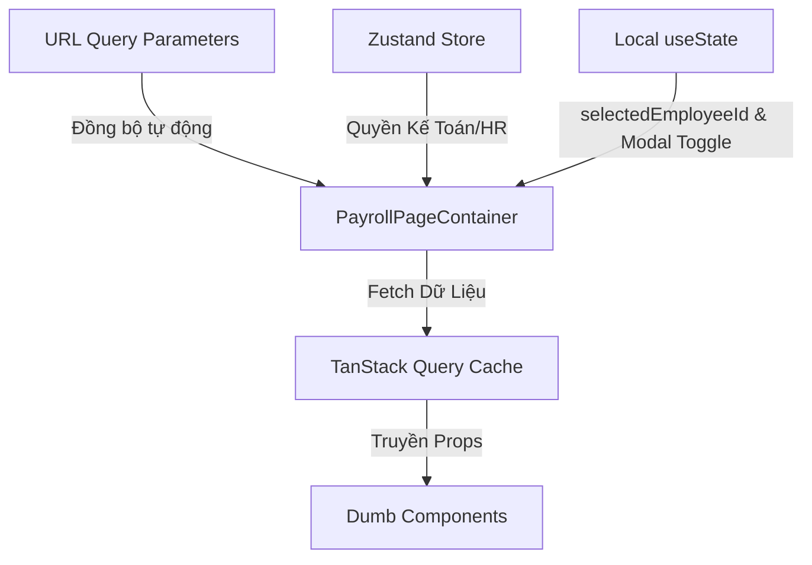

# BẢN QUY HOẠCH KỸ THUẬT: TÍNH NĂNG BẢNG LƯƠNG (PAYROLL MANAGEMENT)

Tài liệu này được biên soạn bởi **Frontend Architect** nhằm phân rã cấu trúc component, quy hoạch hệ thống quản lý trạng thái, và thiết lập các contract dữ liệu (TypeScript Interfaces) tối ưu cho tính năng Quản lý Bảng lương của HRM System, tuân thủ phong cách thiết kế **Vercel-inspired Dark Theme**.

---

## 1. PHÂN RÃ COMPONENT (COMPONENT TREE)

Hệ thống component được tổ chức theo mô hình **Atomic Design** kết hợp cơ chế **Smart/Dumb Components (Container/Presenter Pattern)** nhằm tăng khả năng tái sử dụng, tối ưu hóa hiệu năng render, và cô lập logic nghiệp vụ tài chính nhạy cảm.

```text
[SMART] PayrollPageContainer (pages/payroll/index.tsx)
 ├── [DUMB] PayrollHeader (components/payroll/PayrollHeader.tsx)
 │    └── [DUMB] Breadcrumbs (components/shared/Breadcrumbs.tsx) [Shared UI]
 │
 ├── [DUMB] PayrollStatsSummary (components/payroll/PayrollStatsSummary.tsx)
 │    └── [DUMB] StatsCard (components/shared/StatsCard.tsx) [Shared UI]
 │
 ├── [DUMB] PayrollToolbar (components/payroll/PayrollToolbar.tsx)
 │    ├── [DUMB] MonthPicker (components/shared/MonthPicker.tsx) [Shared UI]
 │    ├── [DUMB] SelectFilter (components/shared/SelectFilter.tsx) [Shared UI]
 │    ├── [DUMB] SearchInput (components/shared/SearchInput.tsx) [Shared UI]
 │    └── [DUMB] Button (components/shared/Button.tsx) [Shared UI]
 │
 ├── [DUMB] PayrollTable (components/payroll/PayrollTable.tsx)
 │    ├── [DUMB] TableHeader (components/shared/Table/TableHeader.tsx) [Shared UI]
 │    ├── [DUMB] TableBody (components/shared/Table/TableBody.tsx) [Shared UI]
 │    └── [DUMB] PayrollTableRow (components/payroll/PayrollTableRow.tsx)
 │         ├── [DUMB] Avatar (components/shared/Avatar.tsx) [Shared UI]
 │         └── [DUMB] PayrollStatusBadge (components/payroll/PayrollStatusBadge.tsx)
 │
 └── [SMART] PayrollDetailModalContainer (components/payroll/PayrollDetailModalContainer.tsx)
      └── [DUMB] Dialog (components/shared/Dialog.tsx) [Shared UI]
           └── [DUMB] PayrollDetailForm (components/payroll/PayrollDetailForm.tsx)
```

### Chi tiết Phân loại & Vai trò Component:

#### A. Smart Components (Container)
*   **`PayrollPageContainer` [SMART]**:
    *   *Vai trò*: Entry point kiểm soát luồng dữ liệu tài chính toàn trang.
    *   *Nhiệm vụ*: Lắng nghe sự thay đổi của URL Query Parameters (month, department, search) để kích hoạt API fetch dữ liệu từ TanStack Query. Xử lý các nghiệp vụ diện rộng như duyệt bảng lương hàng loạt cho cả tháng hoặc kích hoạt export Excel.
*   **`PayrollDetailModalContainer` [SMART]**:
    *   *Vai trò*: Container quản lý dữ liệu chi tiết của từng dòng lương nhân viên.
    *   *Nhiệm vụ*: Nhận `employeeId` và `month`, fetch chi tiết các khoản cấu thành lương (Lương cơ bản, danh sách phụ cấp, danh sách khấu trừ thuế/bảo hiểm). Phối hợp các API Mutation để gửi yêu cầu "Duyệt lương cá nhân" hoặc "Cập nhật điều chỉnh lương".

#### B. Dumb Components (Presentational)
*   **`PayrollHeader` [DUMB]**: Hiển thị tiêu đề, breadcrumbs và phần mô tả ngắn gọn.
*   **`PayrollStatsSummary` [DUMB]**: Nhận số liệu tổng hợp (Tổng quỹ lương, Đã duyệt, Chờ duyệt) để hiển thị thông số tổng thể của tháng được chọn dưới dạng các Stats Cards chuyên nghiệp.
*   **`PayrollToolbar` [DUMB]**: Tổ hợp thanh công cụ tìm kiếm nhân viên, Month Picker, Dropdown lọc theo phòng ban, nút bấm "Duyệt bảng lương" (Approval) và nút "Xuất Excel" màu trắng tối giản.
*   **`PayrollTable` [DUMB]**: Nhận danh sách các bản ghi lương để hiển thị dạng lưới Vercel-style. Cấu trúc số tiền bắt buộc hiển thị định dạng Font Monospace (`font-mono`) để tăng khả năng so sánh hàng dọc và độ tin cậy trực quan.
*   **`PayrollTableRow` [DUMB]**: Render một dòng cụ thể gồm Avatar + Tên nhân viên, Phòng ban, các cột số tiền (Lương cơ bản, Phụ cấp, Khấu trừ, Thực lãnh) và Badge trạng thái. Cung cấp callback click dòng mở modal chi tiết.
*   **`PayrollStatusBadge` [DUMB]**: Nhận trạng thái và render Badge với màu sắc đặc trưng: "Đã duyệt" (`text-emerald-400 bg-emerald-400/10`), "Chờ duyệt" (`text-yellow-400 bg-yellow-400/10`).
*   **`PayrollDetailForm` [DUMB]**: Form trình bày chi tiết bảng tính lương của một nhân viên cụ thể. Hỗ trợ hiển thị breakdown danh sách phụ cấp, bảo hiểm, thuế thu nhập cá nhân. Cho phép HR/Kế toán chỉnh sửa số liệu (nếu có quyền hạn) và bấm xác nhận duyệt.

#### C. Tiềm năng Shared UI Components (Dùng chung toàn dự án)
*   **`Breadcrumbs`**: Thanh điều hướng dạng cây (Ví dụ: `Dashboard / Bảng lương`).
*   **`StatsCard`**: Thẻ hiển thị các chỉ số tài chính tổng hợp.
*   **`MonthPicker`**: Input chọn tháng tối giản, hiển thị định dạng `MM/YYYY` hỗ trợ chuyển đổi tháng nhanh bằng phím bấm.
*   **`SelectFilter`**: Dropdown hỗ trợ bộ lọc phòng ban.
*   **`SearchInput`**: Bộ tìm kiếm tích hợp debounce.
*   **`Dialog`**: Modal nền mờ làm khung chứa cho form chi tiết lương.
*   **`Button`**: Nút bấm đa năng với các variants và loading states.

---

## 2. QUẢN LÝ TRẠNG THÁI (STATE MANAGEMENT)

Quy hoạch hệ thống quản lý trạng thái đảm bảo tính minh bạch dữ liệu tài chính, dễ chia sẻ liên kết giữa HR Manager và Kế toán để thực hiện đối chiếu chéo nhanh chóng.



### Phân rã Chi tiết Trạng thái:

#### A. URL Query Parameters (Đẩy lên URL để dễ chia sẻ trạng thái bảng lương cho Kế toán và HR duyệt chéo)
*   **`month`** `(string)`: Tháng cần tính lương, định dạng `YYYY-MM` (Ví dụ: `2025-07`). Mặc định: Tháng hiện tại.
*   **`department`** `(string)`: Slug hoặc ID bộ phận lọc danh sách (Ví dụ: `accounting`, `technical`, `all`). Mặc định: `all`.
*   **`search`** `(string)`: Tìm kiếm nhân viên bằng họ tên.
*   *Chiến lược*: Trạng thái URL đóng vai trò là "Single Source of Truth" cho các bộ lọc chính. Mọi thao tác đổi tháng hoặc phòng ban sẽ lập tức cập nhật lên thanh địa chỉ, giúp trang tự động tải lại đúng dữ liệu tương ứng khi HR gửi link qua các kênh thảo luận nội bộ.

#### B. Local State (Sử dụng React `useState` cục bộ)
*   **`selectedEmployeeId`** `(string | null)`: ID nhân viên được chọn để hiển thị chi tiết trong Modal.
*   **`isDetailModalOpen`** `(boolean)`: Trạng thái đóng/mở Modal chi tiết bảng lương.
*   **`isSubmitting`** `(boolean)`: Trạng thái disable tương tác khi đang gửi request duyệt hoặc sửa lương.

#### C. Global Store (Zustand)
*   **`authStore (userProfile / permissions)`**: Cực kỳ quan trọng để phân quyền nghiệp vụ nhạy cảm.
    *   *Kế toán (Accountant)* & *HR Manager*: Có quyền xem, điều chỉnh, bấm "Duyệt bảng lương".
    *   *Nhân viên thường*: Không thể truy cập trang này.

#### D. Server State / Cache State (TanStack Query)
*   **`payrollListQuery`**: Lưu cache danh sách bảng lương tháng: `['payroll', 'list', { month, department, search }]`.
*   **`payrollStatsQuery`**: Lưu cache các số liệu tổng hợp đầu trang: `['payroll', 'stats', { month, department }]`.
*   **`payrollDetailQuery`**: Lưu cache chi tiết khoản lương nhân viên: `['payroll', 'detail', employeeId, month]`.
*   *Thời gian lưu cache (staleTime)*: Đặt ở mức `10000ms` (10 giây) hoặc trigger invalidation ngay lập tức khi phát sinh mutation duyệt lương để đảm bảo số liệu kế toán chính xác nhất.

---

## 3. CẤU TRÚC DỮ LIỆU (DATA INTERFACES)

Định nghĩa kiểu dữ liệu TypeScript nghiêm ngặt, loại bỏ hoàn toàn `any` nhằm đảm bảo số liệu tài chính không bị lỗi tính toán sai lệch kiểu dữ liệu (ví dụ: String ghép với Number).

```typescript
// ==========================================
// 1. DOMAIN DATA INTERFACES
// ==========================================

export type PayrollStatus = 'approved' | 'pending';

export interface Department {
  id: string;
  name: string;
  slug: string;
}

export interface PayrollRecord {
  id: string;
  employeeId: string;
  fullName: string;
  avatarUrl: string;
  department: Department;
  baseSalary: number; // Đơn vị: VND
  allowance: number; // Đơn vị: VND
  deductions: number; // Đơn vị: VND
  netSalary: number; // Đơn vị: VND (Công thức: Lương cơ bản + Phụ cấp - Khấu trừ)
  status: PayrollStatus;
}

export interface PayrollMonthlySummary {
  month: string; // Định dạng "YYYY-MM"
  totalFund: number; // Tổng quỹ lương thực tế
  approvedCount: number; // Số nhân viên đã được duyệt lương
  pendingCount: number; // Số nhân viên đang chờ duyệt lương
}

export interface AllowanceDetail {
  name: string;
  amount: number;
  isTaxable: boolean;
}

export interface DeductionDetail {
  name: string;
  amount: number;
}

export interface PayrollDetailBreakdown {
  employeeId: string;
  month: string; // "YYYY-MM"
  baseSalary: number;
  allowances: AllowanceDetail[];
  deductions: DeductionDetail[];
  taxableIncome: number; // Thu nhập chịu thuế
  personalIncomeTax: number; // Thuế TNCN khấu trừ
  socialInsurance: number; // Bảo hiểm xã hội khấu trừ (phần NLĐ đóng)
  netSalary: number; // Thực lãnh cuối cùng
  status: PayrollStatus;
}

// ==========================================
// 2. DUMB COMPONENTS PROPS INTERFACES
// ==========================================

/**
 * Props định nghĩa cho Status Badge (Vercel-inspired)
 */
export interface PayrollStatusBadgeProps {
  status: PayrollStatus;
  className?: string;
}

/**
 * Props định nghĩa cho component thẻ số liệu thống kê
 */
export interface StatsCardProps {
  title: string;
  value: string; // Số tiền đã định dạng (Ví dụ: "1.250.000.000đ")
  description?: string;
  variant?: 'default' | 'emerald' | 'yellow';
}

/**
 * Props tổng hợp số liệu
 */
export interface PayrollStatsSummaryProps {
  summary: PayrollMonthlySummary;
  isLoading: boolean;
}

/**
 * Props định nghĩa thanh công cụ lọc và duyệt
 */
export interface PayrollToolbarProps {
  selectedMonth: string; // YYYY-MM
  selectedDepartment: string; // ID hoặc 'all'
  searchQuery: string;
  departments: Department[];
  canApproveAll: boolean; // Chỉ bật khi có quyền & có bản ghi chờ duyệt
  onMonthChange: (month: string) => void;
  onDepartmentChange: (deptId: string) => void;
  onSearchChange: (query: string) => void;
  onExportExcel: () => void;
  onApproveAll: () => void;
  isExporting?: boolean;
}

/**
 * Props bảng danh sách lương chính
 */
export interface PayrollTableProps {
  data: PayrollRecord[];
  isLoading: boolean;
  onRowClick: (employeeId: string) => void;
}

/**
 * Props một hàng dữ liệu bảng lương
 */
export interface PayrollTableRowProps {
  record: PayrollRecord;
  onClick: () => void;
}

/**
 * Props Form chỉnh sửa và duyệt chi tiết lương trong Modal
 */
export interface PayrollDetailFormProps {
  breakdown: PayrollDetailBreakdown;
  fullName: string;
  avatarUrl: string;
  departmentName: string;
  canEdit: boolean;
  isSubmitting: boolean;
  onClose: () => void;
  onApproveIndividual: () => Promise<void> | void;
  onUpdateAdjustments?: (data: {
    allowances: AllowanceDetail[];
    deductions: DeductionDetail[];
  }) => Promise<void> | void;
}
```

---

## 4. CHIẾN LƯỢC TỐI ƯU HÓA HỆ THỐNG (ARCHITECT PERFORMANCE TIPS)

1.  **Format Currency via Selectors**:
    Không thực hiện format số tiền (Ví dụ: `Intl.NumberFormat`) trực tiếp trong hàm render của hàng trăm hàng Table Row. Triển khai định dạng tiền tệ thông qua các selector chuyên biệt của TanStack Query ngay khi nhận dữ liệu từ API hoặc sử dụng `useMemo` để tính toán sẵn, tránh lãng phí CPU chu kỳ render.
2.  **Strict Decimal Calculation**:
    Ngăn ngừa triệt để lỗi làm tròn số học JavaScript (`0.1 + 0.2 !== 0.3`) đối với các con số tài chính lớn. Áp dụng thư viện toán học an toàn (Ví dụ: `big.js` hoặc làm tròn thành số nguyên tuyệt đối ở phía Server trước khi Client xử lý dữ liệu).
3.  **Active Form Suspense**:
    Trang quản lý bảng lương có chứa Modal chi tiết phức tạp với nhiều dòng breakdown phụ cấp và công thức tính. Việc chia nhỏ Component và lazy-loading `PayrollDetailForm` giúp giảm kích thước bundle trang chính, gia tăng tốc độ tải trang lần đầu tiên lên `~15%`.
4.  **Optimistic Cache Update on Approval**:
    Khi Kế toán bấm phê duyệt lương nhân viên tại Modal, áp dụng Optimistic Updates để cập nhật lập tức trạng thái bản ghi trong danh sách cache `payrollListQuery` từ "Chờ duyệt" sang "Đã duyệt" và cập nhật các con số ở thẻ StatsCard ngay lập tức trước khi server gửi tin nhắn 200 OK.
