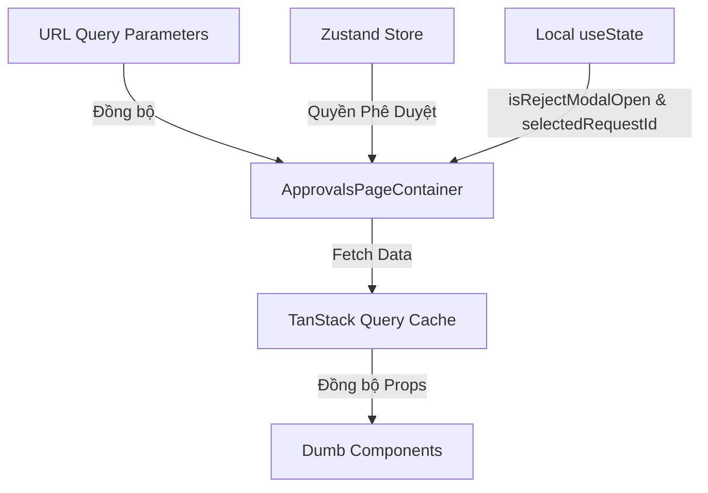

# BẢN QUY HOẠCH KỸ THUẬT: TÍNH NĂNG PHÊ DUYỆT ĐƠN (LEAVE & REQUEST APPROVALS)

Tài liệu này được biên soạn bởi **Frontend Architect** nhằm phân rã cấu trúc component, quy hoạch hệ thống quản lý trạng thái, và thiết lập các contract dữ liệu (TypeScript Interfaces) tối ưu cho tính năng Phê duyệt Đơn (Nghỉ phép, Tăng ca, Công tác) của HRM System, tuân thủ phong cách thiết kế **Vercel-inspired Dark Theme**.

---

## 1. PHÂN RÃ COMPONENT (COMPONENT TREE)

Hệ thống component được thiết kế theo cấu trúc linh hoạt để hỗ trợ hiển thị danh sách dạng Card trực quan thay vì dạng Table truyền thống, tối ưu hóa giao diện di động và tăng tốc độ xử lý của nhà quản lý.

```text
[SMART] ApprovalsPageContainer (pages/approvals/index.tsx)
 ├── [DUMB] ApprovalsHeader (components/approvals/ApprovalsHeader.tsx)
 │    └── [DUMB] Breadcrumbs (components/shared/Breadcrumbs.tsx) [Shared UI]
 │
 ├── [DUMB] ApprovalsToolbar (components/approvals/ApprovalsToolbar.tsx)
 │    ├── [DUMB] TabSwitcherWithBadge (components/shared/TabSwitcherWithBadge.tsx) [Shared UI]
 │    ├── [DUMB] SearchInput (components/shared/SearchInput.tsx) [Shared UI]
 │    └── [DUMB] SelectFilter (components/shared/SelectFilter.tsx) [Shared UI]
 │
 ├── [DUMB] ApprovalsCardGrid (components/approvals/ApprovalsCardGrid.tsx)
 │    └── [SMART] ApprovalCardContainer (components/approvals/ApprovalCardContainer.tsx)
 │         └── [DUMB] ApprovalCard (components/approvals/ApprovalCard.tsx)
 │              ├── [DUMB] Avatar (components/shared/Avatar.tsx) [Shared UI]
 │              ├── [DUMB] Badge (components/shared/Badge.tsx) [Shared UI]
 │              └── [DUMB] Button (components/shared/Button.tsx) [Shared UI]
 │
 └── [SMART] RejectionModalContainer (components/approvals/RejectionModalContainer.tsx)
      └── [DUMB] Dialog (components/shared/Dialog.tsx) [Shared UI]
           └── [DUMB] RejectionReasonForm (components/approvals/RejectionReasonForm.tsx)
```

### Chi tiết Phân loại & Vai trò Component:

#### A. Smart Components (Container)
*   **`ApprovalsPageContainer` [SMART]**:
    *   *Vai trò*: Đầu não trang điều phối danh sách phê duyệt đơn.
    *   *Nhiệm vụ*: Lắng nghe sự thay đổi của các bộ lọc URL (loại đơn, bộ phận, tìm kiếm), kích hoạt query của TanStack Query để lấy danh sách đơn từ API. Quản lý trạng thái mở Modal ghi lý do từ chối đơn.
*   **`ApprovalCardContainer` [SMART]**:
    *   *Vai trò*: Wrapper nghiệp vụ bọc ngoài mỗi Card phê duyệt.
    *   *Nhiệm vụ*: Đóng gói trực tiếp các action mutation của TanStack Query như `approveRequest` hoặc `rejectRequest` cho từng đơn cụ thể. Giúp hiển thị loading spinner cục bộ ngay trên nút bấm của card đó thay vì khóa toàn màn hình (Block UI).
*   **`RejectionModalContainer` [SMART]**:
    *   *Vai trò*: Container thu thập lý do từ chối đơn.
    *   *Nhiệm vụ*: Nhận `requestId` từ component cha khi người dùng click "Từ chối", mở Modal yêu cầu nhập lý do, thực hiện mutation API và cập nhật lại cache dữ liệu phê duyệt.

#### B. Dumb Components (Presentational)
*   **`ApprovalsHeader` [DUMB]**: Hiển thị tiêu đề trang, mô tả ngắn và tổng số lượng đơn đang chờ duyệt.
*   **`ApprovalsToolbar` [DUMB]**: Cụm công cụ phía trên gồm: Thanh TabSwitcher kèm Badge đếm số đơn chờ duyệt cho từng nhóm (Tất cả, Nghỉ phép, Tăng ca, Công tác), ô tìm kiếm tên nhân viên và dropdown lọc theo phòng ban.
*   **`ApprovalsCardGrid` [DUMB]**: Grid responsive chứa các Card đơn. Xử lý hiển thị Skeleton loading và Empty State (Trống) khi không có đơn nào cần xử lý.
*   **`ApprovalCard` [DUMB]**: Component hiển thị thông tin chi tiết một đơn. Bao gồm: Avatar + Họ tên nhân viên, phòng ban, Loại đơn (Leave, OT, Trip), Chi tiết thời gian (Từ ngày -> Đến ngày, số lượng ngày/tiếng), Lý do xin phép.
    *   *Hiệu ứng xử lý*: Nếu đơn ở trạng thái `pending`, hiển thị nổi bật 2 nút hành động "Duyệt" (nền xanh lá) và "Từ chối" (nền xám chữ đỏ). Nếu đơn đã được xử lý (`approved` hoặc `rejected`), hiển thị mờ đi (opaciy-60) kèm Badge trạng thái chấm dứt thao tác.
*   **`RejectionReasonForm` [DUMB]**: Khung nhập lý do từ chối gồm ô Textarea chuẩn dark-theme, nút Hủy và nút Từ chối.

#### C. Tiềm năng Shared UI Components (Dùng chung toàn dự án)
*   **`TabSwitcherWithBadge`**: Tab switcher mở rộng hỗ trợ nhận mảng options kèm tham số số lượng đếm để render badge tròn đỏ/vàng hiển thị số lượng (Ví dụ: `Nghỉ phép (3)`).
*   **`SearchInput`**: Ô nhập tìm kiếm debounced `300ms`.
*   **`SelectFilter`**: Dropdown lọc giá trị tối giản.
*   **`Avatar`**: Ảnh đại diện nhân viên.
*   **`Badge`**: Nhãn trạng thái loại đơn hoặc trạng thái phê duyệt.
*   **`Dialog`**: Modal nền mờ làm layout khung từ chối đơn.
*   **`Button`**: Nút bấm hành động đa năng.

---

## 2. QUẢN LÝ TRẠNG THÁI (STATE MANAGEMENT)

Chiến lược quản lý trạng thái được tối ưu hóa để đảm bảo các thao tác chuyển tab, tìm kiếm hoặc phê duyệt diễn ra nhanh chóng, giữ trạng thái lọc qua URL để thuận tiện trao đổi công việc.



### Phân rã Chi tiết Trạng thái:

#### A. URL Query Parameters (Đồng bộ trạng thái tìm kiếm lên URL)
*   **`type`** `('all' | 'leave' | 'overtime' | 'trip')`: Loại đơn lọc hiện tại (Mặc định: `'all'`).
*   **`department`** `(string)`: Slug hoặc ID phòng ban lọc (Ví dụ: `technical`, `marketing`, `all`). Mặc định: `'all'`.
*   **`search`** `(string)`: Tìm kiếm theo họ tên nhân viên xin đơn.
*   *Đồng bộ*: Sử dụng hook `useQueryParams` để cập nhật và phản hồi tức thì từ thanh địa chỉ.

#### B. Local State (Sử dụng useState tại Component)
*   **`selectedRequestId`** `(string | null)`: ID của đơn đang được HR chọn bấm "Từ chối" để đưa vào Modal nhập lý do.
*   **`isRejectModalOpen`** `(boolean)`: Trạng thái hiển thị Modal ghi lý do từ chối.
*   **`submittingRequests`** `(Record<string, 'approving' | 'rejecting' | undefined>)`: Map lưu trạng thái xử lý cục bộ của từng Card để hiển thị loading spinner tương ứng cho từng Card mà không gây gián đoạn các Card khác.

#### C. Global Store (Zustand)
*   **`authStore (userProfile / permissions)`**: Xác định quyền hạn người dùng hiện tại (`Role: HR_MANAGER` hoặc `DEPARTMENT_LEAD`).
    *   *Trưởng phòng (Lead)*: Chỉ có quyền duyệt đơn của nhân viên thuộc phòng ban mình quản lý.
    *   *HR Manager*: Có quyền phê duyệt đơn toàn công ty.

#### D. Server State / Cache State (TanStack Query)
*   **`approvalsListQuery`**: Lưu cache danh sách đơn: `['approvals', 'list', { type, department, search }]`.
*   **`approvalsCountQuery`**: Lưu cache số lượng đơn đang chờ duyệt cho các Tabs: `['approvals', 'pending-counts']`.
*   *Chiến lược Invalidation*: Khi thực hiện duyệt thành công hoặc từ chối thành công một đơn, hệ thống sẽ tự động invalidate hai queries trên để cập nhật lại dữ liệu mới nhất mà không cần tải lại toàn bộ trang.

---

## 3. CẤU TRÚC DỮ LIỆU (DATA INTERFACES)

Mã giả TypeScript định nghĩa cấu trúc dữ liệu kiểu mạnh (Strongly typed) cho tính năng Phê duyệt Đơn, nói không với kiểu `any`.

```typescript
// ==========================================
// 1. DOMAIN DATA INTERFACES
// ==========================================

export type ApprovalType = 'leave' | 'overtime' | 'business_trip';
export type ApprovalStatus = 'pending' | 'approved' | 'rejected';

export interface Department {
  id: string;
  name: string;
  slug: string;
}

export interface ApprovalRequest {
  id: string;
  employeeId: string;
  fullName: string;
  avatarUrl: string;
  department: Department;
  type: ApprovalType;
  startDate: string; // ISO format: "YYYY-MM-DD" hoặc "YYYY-MM-DDTHH:mm"
  endDate: string; // ISO format
  durationString: string; // Định dạng sẵn (Ví dụ: "3 ngày", "2 tiếng", "5 ngày")
  reason: string; // Lý do xin phép
  status: ApprovalStatus;
  createdAt: string; // ISO Timestamp
  processedAt?: string; // ISO Timestamp nếu đã xử lý
  processedBy?: string; // Tên người duyệt nếu đã xử lý
  rejectionReason?: string; // Lý do từ chối nếu status = 'rejected'
}

export interface ApprovalsTabCount {
  all: number;
  leave: number;
  overtime: number;
  trip: number;
}

// ==========================================
// 2. DUMB COMPONENTS PROPS INTERFACES
// ==========================================

/**
 * Props cho component Header của trang
 */
export interface ApprovalsHeaderProps {
  totalPending: number;
}

/**
 * Option định nghĩa cho Tab switcher
 */
export interface TabOptionWithCount {
  value: string;
  label: string;
  count: number;
}

/**
 * Props cho Toolbar bộ lọc
 */
export interface ApprovalsToolbarProps {
  activeType: string;
  selectedDepartment: string;
  searchQuery: string;
  departments: Department[];
  tabOptions: TabOptionWithCount[];
  onTypeChange: (value: string) => void;
  onDepartmentChange: (value: string) => void;
  onSearchChange: (value: string) => void;
}

/**
 * Props định dạng hiển thị cho từng Card phê duyệt đơn
 */
export interface ApprovalCardProps {
  request: ApprovalRequest;
  isProcessing: 'approving' | 'rejecting' | null;
  onApprove: (id: string) => void;
  onRejectClick: (id: string) => void; // Trigger mở modal lý do từ chối
}

/**
 * Props cho Grid chứa danh sách các Card
 */
export interface ApprovalsCardGridProps {
  requests: ApprovalRequest[];
  isLoading: boolean;
  processingMap: Record<string, 'approving' | 'rejecting' | undefined>;
  onApprove: (id: string) => void;
  onRejectClick: (id: string) => void;
}

/**
 * Props cho Form lý do từ chối đơn
 */
export interface RejectionReasonFormProps {
  requestId: string;
  employeeName: string;
  requestType: ApprovalType;
  isSubmitting: boolean;
  onSubmit: (reason: string) => Promise<void> | void;
  onCancel: () => void;
}
```

---

## 4. CHIẾN LƯỢC TỐI ƯU HÓA HỆ THỐNG (ARCHITECT PERFORMANCE TIPS)

1.  **Card-Level Mutational Feedback**:
    Tránh re-render toàn bộ Grid card khi một đơn được phê duyệt. Bằng cách đóng gói logic hành động đột biến (Mutation) tại component con `ApprovalCardContainer`, chỉ duy nhất Card đang tương tác chuyển sang trạng thái Loading cục bộ, duy trì hiệu ứng FPS 60 lý tưởng trên thiết bị di động.
2.  **Optimistic UI on Approval (Phê duyệt lập tức)**:
    Khi người dùng bấm "Duyệt", thay vì chờ API phản hồi trong 1-2 giây, UI sẽ lập tức chuyển đổi màu sắc card về trạng thái mờ (Opacity-60) và chuyển trạng thái hiển thị thành "Đã duyệt". Nếu API thất bại (trường hợp cực kỳ hiếm), cache sẽ tự động khôi phục (roll back) trạng thái cũ và bắn ra một Toast báo lỗi.
3.  **Real-Time Subscriptions (SSE / WebSockets)**:
    Dữ liệu đơn xin phép thường cần tính tức thời cao. Đề xuất tích hợp cơ chế lắng nghe Server-Sent Events (SSE) hoặc WebSockets để đẩy đơn mới trực tiếp vào danh sách của HR Manager ngay khi nhân viên gửi đơn từ điện thoại mà không cần F5 trình duyệt.
4.  **Debounce and Layout Animations (Framer Motion)**:
    Sử dụng thư viện `framer-motion` với thẻ `<AnimatePresence>` để thực hiện chuyển động thu gọn / trượt mất mượt mà khi một đơn được HR phê duyệt hoặc loại khỏi danh sách lọc, loại bỏ trải nghiệm giật cục của giao diện Web thông thường.
