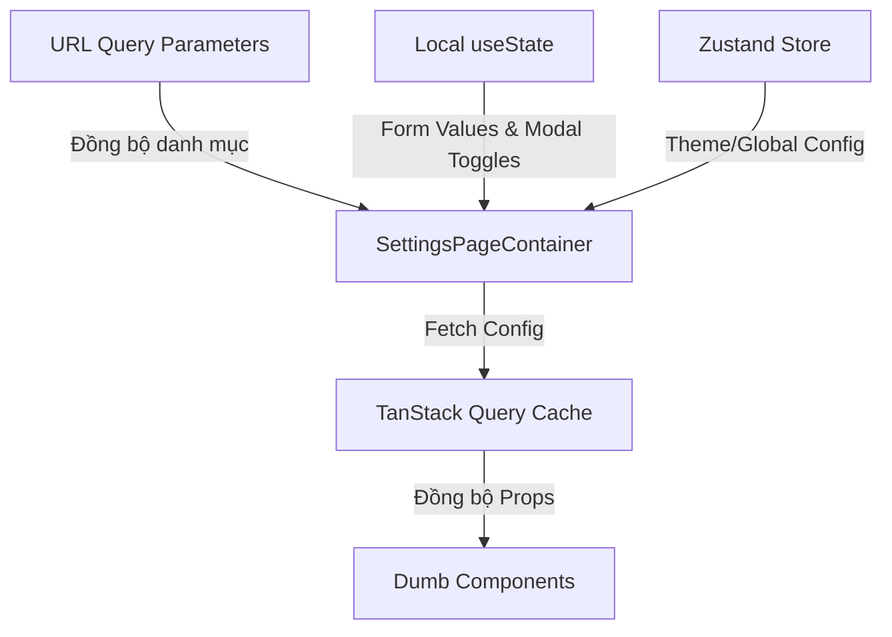

# BẢN QUY HOẠCH KỸ THUẬT: TÍNH NĂNG CÀI ĐẶT HỆ THỐNG (SYSTEM SETTINGS)

Tài liệu này được biên soạn bởi **Frontend Architect** nhằm phân rã cấu trúc component, quy hoạch hệ thống quản lý trạng thái, và thiết lập các contract dữ liệu (TypeScript Interfaces) tối ưu cho tính năng Cài đặt Hệ thống của HRM System, tuân thủ phong cách thiết kế **Vercel-inspired Dark Theme**.

---

## 1. PHÂN RÃ COMPONENT (COMPONENT TREE)

Trang cài đặt hệ thống được thiết kế theo cấu trúc Layout 2 cột đặc trưng: Menu danh mục dán cố định (Sticky Sidebar Nav) bên trái và vùng cuộn hiển thị chi tiết các phân hệ cài đặt bên phải, tạo ra trải nghiệm quản trị mượt mà và liền mạch.

```text
[SMART] SettingsPageContainer (pages/settings/index.tsx)
 ├── [DUMB] SettingsHeader (components/settings/SettingsHeader.tsx)
 │    └── [DUMB] Breadcrumbs (components/shared/Breadcrumbs.tsx) [Shared UI]
 │
 └── [DUMB] SettingsLayout (components/settings/SettingsLayout.tsx)
      ├── [DUMB] SettingsSidebarNav (components/settings/SettingsSidebarNav.tsx)
      │    └── [DUMB] SidebarNavItem (components/shared/SidebarNavItem.tsx) [Shared UI]
      │
      └── [DUMB] SettingsContentArea (components/settings/SettingsContentArea.tsx)
           │
           ├── [SMART] DepartmentSettings (components/settings/sections/DepartmentSettings.tsx)
           │    ├── [DUMB] DepartmentList (components/settings/sections/DepartmentList.tsx)
           │    └── [SMART] DepartmentModal (components/settings/sections/DepartmentModal.tsx)
           │         └── [DUMB] Dialog (components/shared/Dialog.tsx) [Shared UI]
           │              └── [DUMB] DepartmentForm (components/settings/sections/DepartmentForm.tsx)
           │
           ├── [SMART] WorkTimeSettings (components/settings/sections/WorkTimeSettings.tsx)
           │    └── [DUMB] WorkTimeForm (components/settings/sections/WorkTimeForm.tsx)
           │         └── [DUMB] ToggleSwitch (components/shared/ToggleSwitch.tsx) [Shared UI]
           │
           └── [SMART] AccountPermissionSettings (components/settings/sections/AccountPermissionSettings.tsx)
                ├── [DUMB] PermissionTable (components/settings/sections/PermissionTable.tsx)
                └── [SMART] PermissionModal (components/settings/sections/PermissionModal.tsx)
                     └── [DUMB] Dialog (components/shared/Dialog.tsx) [Shared UI]
                          └── [DUMB] PermissionForm (components/settings/sections/PermissionForm.tsx)
```

### Chi tiết Phân loại & Vai trò Component:

#### A. Smart Components (Container)
*   **`SettingsPageContainer` [SMART]**:
    *   *Vai trò*: Entry point tổng hợp của trang Cài đặt.
    *   *Nhiệm vụ*: Lắng nghe các chỉ số cuộn màn hình hoặc URL Query parameters để xác định danh mục cài đặt hiện tại đang xem. Thực hiện API fetch đồng thời các cấu hình hệ thống ban đầu (quy định giờ, phòng ban, danh sách phân quyền) thông qua cơ chế song song của TanStack Query.
*   **`DepartmentSettings` [SMART]**:
    *   *Vai trò*: Quản lý nghiệp vụ thêm/sửa/xóa phòng ban.
    *   *Nhiệm vụ*: Cung cấp logic API xử lý CRUD phòng ban, truyền dữ liệu phòng ban xuống cho danh sách hiển thị và quản lý state mở Dialog điền thông tin.
*   **`WorkTimeSettings` [SMART]**:
    *   *Vai trò*: Kiểm soát cấu hình giờ giấc chấm công.
    *   *Nhiệm vụ*: Xử lý logic Form cấu hình giờ làm việc, giờ nghỉ trưa, quy định đi trễ. Kết nối mutation API để gửi yêu cầu lưu cấu hình mới khi Admin bấm "Lưu".
*   **`AccountPermissionSettings` [SMART]**:
    *   *Vai trò*: Quản lý tài khoản quản trị và phân quyền hệ thống.
    *   *Nhiệm vụ*: Thực hiện tải danh sách tài khoản quản trị cùng quyền hạn, xử lý logic chỉnh sửa gán quyền và tạo tài khoản mới.

#### B. Dumb Components (Presentational)
*   **`SettingsHeader` [DUMB]**: Hiển thị tiêu đề lớn "Cài đặt hệ thống" và mô tả ngắn.
*   **`SettingsLayout` [DUMB]**: Layout chia cột sử dụng CSS Grid/Flexbox của Tailwind. Sidebar Nav chiếm cột trái (250px, cố định vị trí khi cuộn trang - `sticky top`), vùng nội dung chính chiếm cột phải rộng hơn.
*   **`SettingsSidebarNav` [DUMB]**: Menu dọc gồm các liên kết: "Phòng ban & Chức vụ", "Quy định chấm công", "Tài khoản & Phân quyền". Nhận prop `activeSection` để tô sáng menu hiện hành.
*   **`DepartmentList` [DUMB]**: Hiển thị danh sách các phòng ban với chỉ số số lượng nhân sự thuộc phòng ban đó. Cung cấp nút sửa, xóa kèm theo cảnh báo nguy hiểm (`text-red-400 hover:bg-red-400/10`).
*   **`DepartmentForm` [DUMB]**: Form điền tên phòng ban và chức danh đi kèm.
*   **`WorkTimeForm` [DUMB]**: Các ô input dạng số và giờ tối giản (`bg-zinc-900 border border-zinc-700 focus:border-zinc-500`) cấu hình thời gian bắt đầu, kết thúc, nghỉ trưa và quy định số phút cho phép đi trễ.
*   **`PermissionTable` [DUMB]**: Bảng danh sách tài khoản Admin gồm: Email, Quyền hạn (Toàn quyền, Chỉ đọc, v.v.), Nút điều chỉnh.
*   **`PermissionForm` [DUMB]**: Form chỉ định email tài khoản và phân cấp bậc quyền quản trị qua hệ thống Checkbox hoặc Selectbox.

#### C. Tiềm năng Shared UI Components (Dùng chung toàn dự án)
*   **`SidebarNavItem`**: Phần tử menu dọc có hiệu ứng hover mượt và active indicator.
*   **`ToggleSwitch`**: Switch gạt bật/tắt (Ví dụ: "Bật phạt đi trễ").
*   **`Dialog`**: Modal base chứa Form popup.
*   **`Button`**: Component nút bấm hỗ trợ variant lưu màu xanh dương (`bg-blue-600 hover:bg-blue-500`) và variant hủy/xóa (`bg-zinc-800`).

---

## 2. QUẢN LÝ TRẠNG THÁI (STATE MANAGEMENT)

Hệ thống quản lý trạng thái trang cài đặt chú trọng tính cục bộ của Form để tránh re-render toàn trang và tối ưu hóa điều hướng thông qua URL.



### Phân rã Chi tiết Trạng thái:

#### A. URL Query Parameters & Hash (Đồng bộ vị trí điều hướng)
*   **`section`** `('departments' | 'attendance' | 'permissions')`: Xác định tab danh mục cài đặt hiện hành (Mặc định: `'departments'`).
    *   *UX Benefit*: Cho phép Admin lưu bookmark hoặc chia sẻ link trực tiếp đi thẳng vào tab "Cấu hình giờ làm việc" (`/settings?section=attendance`) mà không cần phải nhấp chọn lại danh mục từ đầu.

#### B. Local State (Sử dụng useState tại từng Section để tối ưu hóa hiệu năng cô lập)
*   **`activeSection`** `(string)`: Đồng bộ hóa tab sidebar active dựa trên vị trí cuộn màn hình (Scroll position) hoặc router param.
*   **`editingDeptId / editingAccountId`** `(string | null)`: Định danh phòng ban hoặc tài khoản đang được mở form cập nhật.
*   **`isDeptModalOpen / isPermModalOpen`** `(boolean)`: Trạng thái hiển thị các Modal thao tác.
*   **`formDrafts`**: Trạng thái lưu tạm thời các giá trị đang gõ trong form trước khi bấm "Lưu" (đảm bảo thay đổi không ghi đè trực tiếp lên Cache chung).

#### C. Global Store (Zustand)
*   **`systemConfigStore`**: Chứa một số hằng số cấu hình hệ thống cốt lõi sau khi lưu thành công (Ví dụ: Giờ quy định bắt đầu đi làm để các trang khác như Chấm Công tham chiếu nhanh mà không cần gọi lại API).

#### D. Server State / Cache State (TanStack Query)
*   **`departmentsConfigQuery`**: Cache danh sách phòng ban và số lượng thành viên: `['settings', 'departments']`.
*   **`workTimeConfigQuery`**: Cache giờ giấc chấm công: `['settings', 'work-time']`.
*   **`accountsPermissionQuery`**: Cache danh sách phân quyền Admin: `['settings', 'permissions']`.
*   *Thời gian lưu cache (staleTime)*: Thiết lập `Infinity` (Vô hạn) hoặc chỉ refetch khi phát sinh mutation thêm/sửa/xóa, bởi vì các cấu hình hệ thống này rất hiếm khi thay đổi liên tục bởi người dùng.

---

## 3. CẤU TRÚC DỮ LIỆU (DATA INTERFACES)

Định nghĩa kiểu dữ liệu TypeScript nghiêm ngặt, loại bỏ hoàn toàn `any` cho các hợp đồng dữ liệu cài đặt.

```typescript
// ==========================================
// 1. DOMAIN DATA INTERFACES
// ==========================================

export interface DepartmentSettingItem {
  id: string;
  name: string;
  memberCount: number;
  roles: string[]; // Danh sách chức vụ trực thuộc phòng ban (Ví dụ: ["FE Lead", "BE Dev"])
}

export interface WorkTimeConfig {
  startTime: string; // Định dạng "HH:mm" (Ví dụ: "08:00")
  endTime: string; // Định dạng "HH:mm" (Ví dụ: "17:30")
  lunchStartTime: string; // Định dạng "HH:mm" (Ví dụ: "12:00")
  lunchEndTime: string; // Định dạng "HH:mm" (Ví dụ: "13:00")
  lateThresholdMinutes: number; // Đi trễ sau x phút (Ví dụ: 15 phút)
  applyLateRules: boolean; // Bật tắt cơ chế tính đi trễ
}

export type PermissionRole = 'SUPER_ADMIN' | 'HR_MANAGER' | 'ACCOUNTANT' | 'DEPT_LEAD';

export interface AdminAccount {
  id: string;
  email: string;
  fullName: string;
  role: PermissionRole;
  isActive: boolean;
}

// ==========================================
// 2. DUMB COMPONENTS PROPS INTERFACES
// ==========================================

/**
 * Props cho Sidebar điều hướng cài đặt
 */
export interface SettingsSidebarNavProps {
  activeSection: string;
  onSectionSelect: (section: string) => void;
}

/**
 * Props danh sách phòng ban
 */
export interface DepartmentListProps {
  departments: DepartmentSettingItem[];
  onEditClick: (id: string) => void;
  onDeleteClick: (id: string) => void;
}

/**
 * Props Form điền thông tin phòng ban
 */
export interface DepartmentFormProps {
  initialData?: Partial<DepartmentSettingItem>;
  isSubmitting: boolean;
  onSubmit: (data: { name: string; roles: string[] }) => Promise<void> | void;
  onCancel: () => void;
}

/**
 * Props Form cấu hình thời gian
 */
export interface WorkTimeFormProps {
  config: WorkTimeConfig;
  isSaving: boolean;
  onSave: (data: WorkTimeConfig) => Promise<void> | void;
}

/**
 * Props Bảng danh sách phân quyền Admin
 */
export interface PermissionTableProps {
  accounts: AdminAccount[];
  onEditRole: (id: string) => void;
  onToggleStatus: (id: string, active: boolean) => void;
}

/**
 * Props Form cấu hình phân quyền Admin
 */
export interface PermissionFormProps {
  account?: AdminAccount;
  isSubmitting: boolean;
  onSubmit: (data: { email: string; role: PermissionRole }) => Promise<void> | void;
  onCancel: () => void;
}
```

---

## 4. CHIẾN LƯỢC TỐI ƯU HÓA HỆ THỐNG (ARCHITECT PERFORMANCE TIPS)

1.  **Form Dirty States Confirmation (Cảnh báo mất thay đổi)**:
    Khi người dùng đã thay đổi dữ liệu trên Form cài đặt quy định chấm công nhưng cố tình click chuyển tab hoặc thoát trang mà chưa bấm "Lưu", kích hoạt Dialog cảnh báo xác nhận (`isDirty` state của React Hook Form) nhằm ngăn chặn việc vô tình làm mất thông tin cài đặt quan trọng.
2.  **Section Intersection Observer**:
    Tận dụng `IntersectionObserver` API để theo dõi vị trí cuộn của các Section cài đặt ở cột bên phải. Khi Section "Quy định chấm công" cuộn vào viewport chính, Sidebar Nav bên trái sẽ tự động cập nhật active tab tương ứng mà không làm giật lag giao diện.
3.  **Strict Validation on Financial Times**:
    Định dạng cấu hình giờ làm việc phải được xác thực nghiêm ngặt bằng biểu thức chính quy (Regex) ở phía Client và Schema validation (Ví dụ: Zod / Yup) trước khi truyền về API để tránh làm sai lệch cơ chế tính toán log chấm công tự động của hệ thống HRM.
4.  **Instant Permission Propagation**:
    Khi Admin tiến hành thay đổi quyền hạn của một tài khoản thành viên trong hệ thống cài đặt, gửi lệnh thu hồi token (Token revocation) ở server và sử dụng cơ chế broadcast hoặc refetch tức thì ở client để áp dụng quyền truy cập mới ngay lập tức mà không cần người dùng đó đăng xuất đăng nhập lại.
